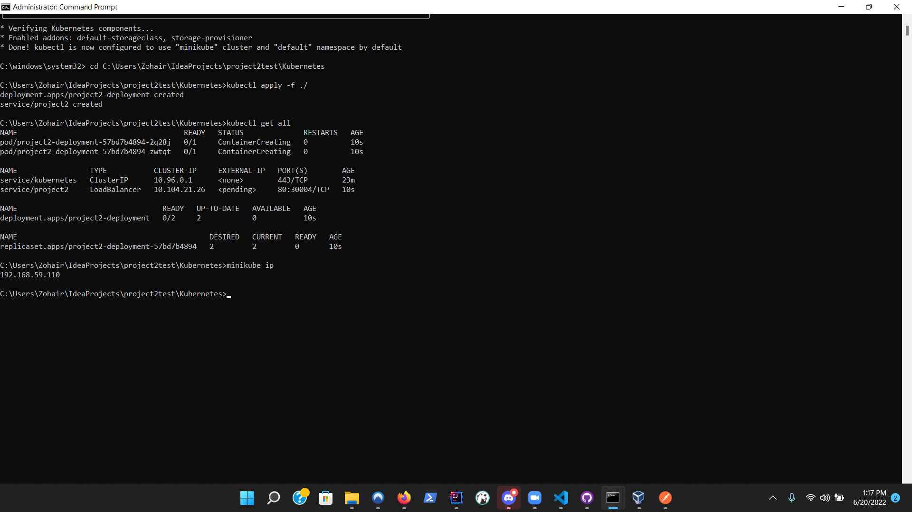
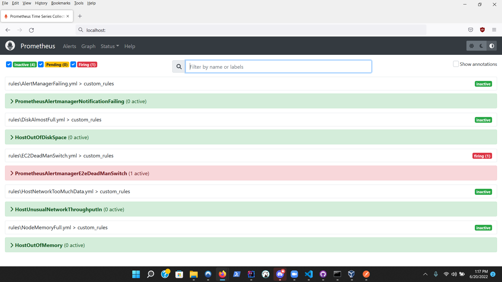
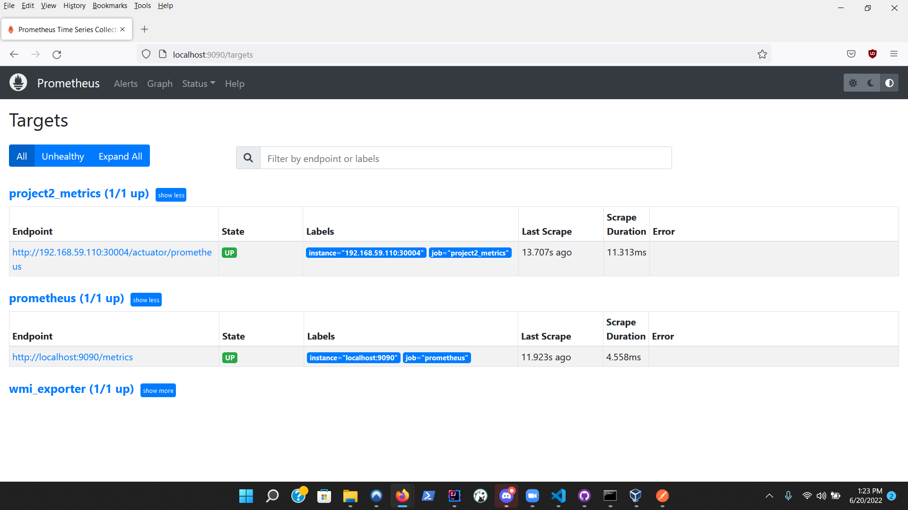
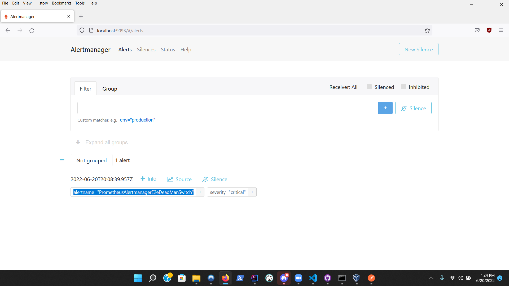
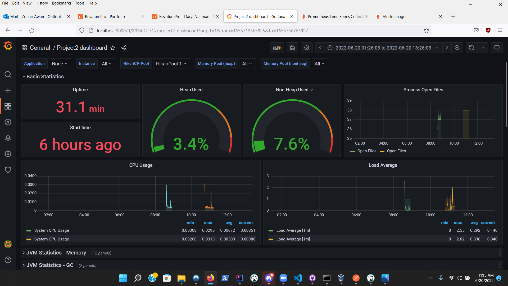
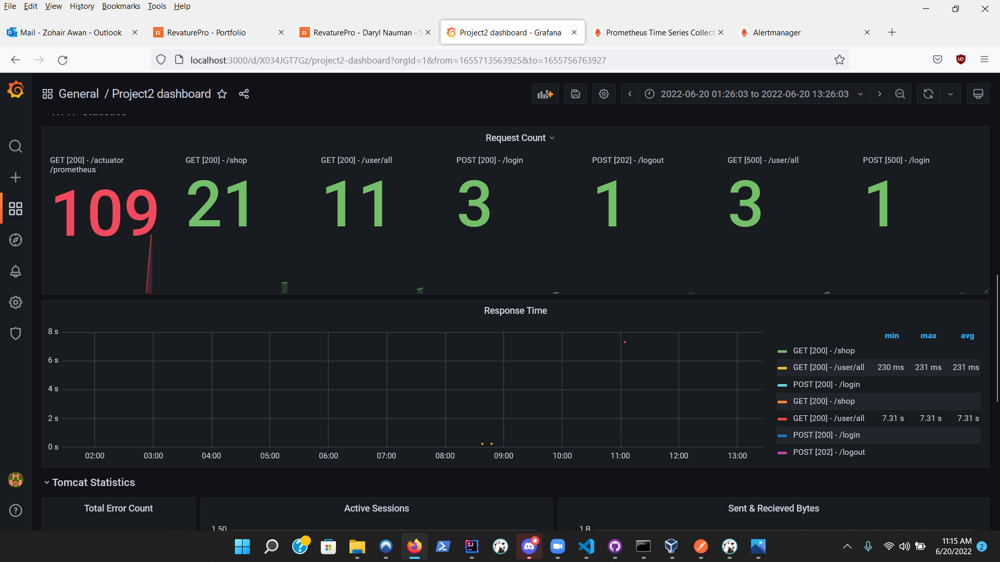

# Project 2

Project 2 will be a group project. Groups will consist of 3 - 4 people.

Each team must designate one member of the team to act as Team Leader. Then decide on a team name.

Each team will choose a project from one of their member's Project 1's.

Teams are allowed to create new namespaces on the SRE Cluster for Project 2.
If done, the selected project must be deployed in the new namespace.

Each team will follow an Agile approach, and track needed tasks with JIRA. Daily Standups will happen separately for each group, led by the Team Leader. Each team must have a kanban board.
It is recommended to track the team's velocity.
___
>### Deadline
>June 20th, 2022
>
>### Requirements
>
>- Each team must configure Prometheus to retrieve metrics from the deployed application
>
>- Teams must create custom metrics through the micrometer API
>    - 3 member teams must create at least 1 custom metric
>    - 4 member teams must create at least 2 custom metrics
>    - These will be incorporated into the SLOs, so they should indicate something about the quality of the application
>    - Must be approved by the Trainer
>
>- Each team must define an SLO for their application.
>    - Must include error rates as well as latencies
>    - Must include their custom metrics
>
>- Each team must define custom recording and alerting rules based on their SLOs
>    - These must follow the multi-window, multi-burn rate approach
>
>- Each team must have a full DevOps pipeline built using Jenkins
>    - This pipeline must be configured through a Jenkinsfile and triggered in response to a webhook
>    - The pipeline must also be configured with a SonarCloud quality gate
>        - This additionally means that the project must have unit tests
>        - The only requirement will be to have minimum 70% test coverage for the service package
>    - The project will be deployed with a canary deployment model
>        - Custom Dockerfiles must be designed and used
>        - No more usage of `mvn spring-boot:build-image`
>            - However, teams may design their Dockerfiles based on it
>
>- Each team must create at least 1 Grafana dashboard to track all of the metrics associated with their SLO
>    - Teams with 4 members must also have additional panels
>        - Could be in a second dashboard
>    - The details for the additional panels must be approved by the Trainer
>    - Examples could be tracking relevant logs of the application or cpu/memory usage from Prometheus
>    - The more closely this additional dashboard indicates potential issue scenarios, the better
>    - The idea is to have visualizations that might indicate that a problem might occur soon, even if an alert has not fired yet
---
>## SLI (_Service Level Indicator_)
1) Assurance of various metrics monitoring (AlertManagerFailing)
2) Disk space reliability (DiskAlmostFull)
3) Node space reliability (NodeMemoryFull)
4) Suspicious or high traffic monitoring (HostNetworkTooMuchData)
5) Comprehensive traffic monitoring
6) Full application analysis
>## SLO (_Service Level Objective_)
1) 90% guaranteed uptime whenever we can afford to host
2) Guaranteed monitoring of traffic, health metrics, and error tracking
3) Prevention of host disk running out of space by alerting you when disk space is 10% or below
4) Prevention of nodes running out of space by alerting you when 10% or below
5) Alert notification for high amounts of traffic or potential DDoS attacks
6) Accurate traffic monitoring by tallying the exact number of requests and the specific kind of requests(GET,POST,etc...)
7) Complete application metrics coverage including data aggregation of basic, memory, GC, HikariCP, HTTP, Tomcat, and Logback statistics
____
>## Documentation:
>- Starting project 2 via kubernetes
>  - 
>- Checking to see which alerts are firing via prometheus UI
>  - 
>- Ensuring the appropriate jobs are up and running via prometheus UI
>  - 
>- Validating that prometheus and alert manager are properly configured and communicating with one another
>  - 
>- Analyzing statistical data of project 2 application via Grafana
>  - 
>  - 
> 
>>### Setting up the Jenkins Pipeline
>> - Navigate to the directory of your jenkins.war and start it in cmd or powershell
>> 
>> - Once Jenkins is running, create a new pipeline by clicking on "New Item" in the sidebar, giving it a name and selecting the pipeline option
>> 
>> - Configure the pipeline to look at the current repo and set it to poll every minute, also set the pipeline script to use the Jenkinsfile included in the repo.
>> 
>> - Click "Build Now" to force the pipeline to build the latest version of the repo, package it and then push the docker container to the 'project2-latest' tag.
>> 
> ---
>## Technologies Used:
>- Java
>- Maven
>- Spring Framework:
>  - Developer Tools:
>    - SpringBoot DevTools
>    - Lombok
>  - Web
>    - Spring Web
>  - Spring Boot Data JPA
>  - Spring Boot Actuator
>  - Spring AOP
>- AWS
>  - RDS
>- Logback
>- Logcack-classic
>- Logback-core
>- Log4J
>- Postman
>- Git
>- Grafana
>- Prometheus
>- Alert Manager
>- nssm
>## Secondary applications required:
>- Postman
>- Prometheus
>- Alert Manager
>- nssm

>## How to run application:
>- Open command prompt as an administrator
>- Start minikube
>- In command prompt navigate to 'Kubernetes' folder of project 2
>- Once inside the Kubernetes folder run the command 'minikube kubectl apply -f ./'
>- Run command 'minikube ip' and take note of the IP address it returns
>- Go to your local prometheus.yml/yaml file, create a job, and paste the IP address in targets
>- Open a new command prompt as an administrator and start up prometheus and alert manager via nssm
>- Open Postman and start executing commands(see below for a list of Postman commands)
>- Open a web browser and type localhost:3000 to navigate to Grafana homepage
>- Navigate to the dashboard to view the application metrics
---
>## Postman commands:
>- NOTE: When sending the requests via postman